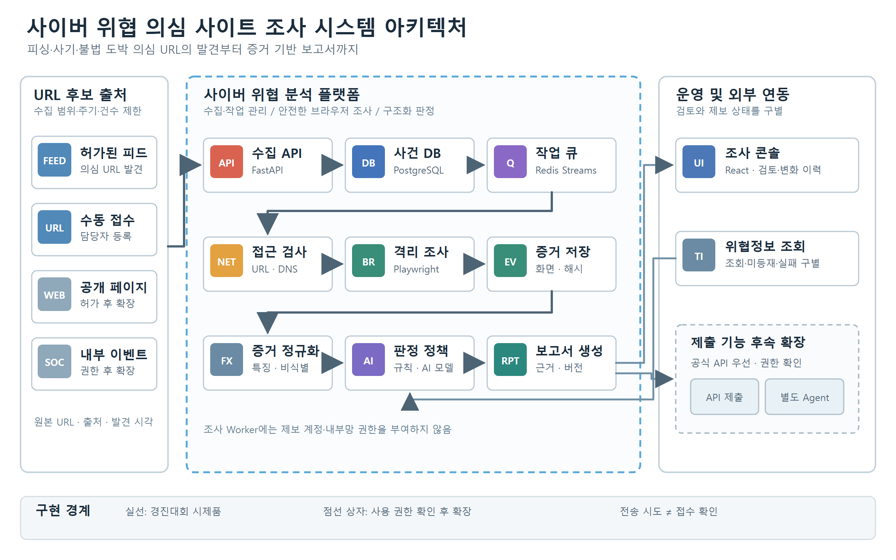

# Threat Investigator

AI 기반 사이버 위협 의심 사이트 자동 탐색·분석·제보 지원 시스템 — 2026 소프트웨어 개발보안 경진대회 출품작.

피싱·사기·불법 도박 의심 URL을 격리 브라우저로 관찰해 증거를 남기고, 규칙과 검증된 AI로 판정 근거를 만들어
담당자가 검토·제보할 수 있는 보고서를 생성한다. 결과는 의심 징후에 대한 기술적 평가이며 법적 판정이나 자동 차단이 아니다.



## 구성

| 경로 | 내용 |
|---|---|
| `backend/` | FastAPI API, SQLAlchemy 모델, Alembic 마이그레이션, outbox relay |
| `worker/` | Redis Streams 소비자, Playwright 격리 조사(스크린샷·페이지 요약·이동 경로·네트워크 요약), 내부 API로 증거 업로드 |
| `worker/worker/feed.py` | 위협정보 피드 자동 수집기(`feed-collector` 서비스). 체크섬 검증 후 내부 API로 등록, 피드 건은 낮은 우선순위 스트림 |
| `egress-proxy/` | Worker 전용 송신 프록시(표준 라이브러리만 사용). 연결마다 목적지 IP 검사, 검사한 IP로 직접 연결(DNS 리바인딩 차단) |
| `frontend/` | React + TypeScript 조사 콘솔 (nginx, 엄격한 CSP). URL 등록, **신고 CSV 일괄 등록**(예시: `frontend/public/report-template.csv`), 사건 상세 |
| `testsites/` | 가상 브랜드 시험 페이지 (피싱·사기·도박·동적 렌더링·리다이렉트·SSRF·XSS·프롬프트 인젝션·정상) |
| `docs/` | 위협 모델, 시큐어코딩 체크리스트 |
| `.github/workflows/` | CI(테스트·린트·빌드), 보안 점검(Bandit·Semgrep·pip-audit·npm audit·gitleaks·Trivy) |

## 실행 (Docker)

```bash
cp .env.example .env        # 비밀번호와 WORKER_API_TOKEN(32자 이상)을 바꾼다
docker compose up --build
```

- 조사 콘솔: http://127.0.0.1:8080
- 시험 페이지: http://127.0.0.1:8081 (콘솔에서는 `http://testsites:8080/phishing.html` 형태로 등록)

## 로컬 개발 (Docker 없이)

```bash
# backend (테스트는 SQLite 메모리 DB를 쓰므로 PostgreSQL 없이 실행된다)
cd backend
python -m venv .venv && . .venv/Scripts/activate   # macOS/Linux: . .venv/bin/activate
pip install -r requirements-dev.txt
pytest

# worker (브라우저 통합 시험에 Chromium 필요)
cd worker
python -m venv .venv && . .venv/Scripts/activate
pip install -r requirements-dev.txt
python -m playwright install chromium
pytest

# frontend (백엔드가 localhost:8000에 떠 있으면 /api를 프록시한다)
cd frontend
npm ci
npm run dev
```

## 진행 현황

| 주차 | 목표 | 상태 |
|---|---|---|
| 1 | 설계, 뼈대, CI, DB 스키마, 보안약점 체크리스트 | ✅ |
| 2 | URL 등록 → 안전 검사 → Worker 스크린샷·이동 경로 → 해시 저장 → 콘솔 표시 | ✅ |
| 3 | 격리 강화(송신 통제, seccomp, 연결 IP 재검사), 멱등 처리 | ⬜ |
| 4 | 유형별 규칙 엔진, 로그인·RBAC·CSRF | ⬜ |
| 5 | AI 모델 비교, 출력 검증, 외부 조회 1종 | ⬜ |
| 6 | 보고서, 모의 제출 상태, 재분석 비교, DAST·Trivy 점검 | ⬜ |
| 7 | 시연 시나리오, 결과보고서 | ⬜ |

## 위협정보 피드 (자동 탐색)

`feed-collector`는 기본값으로 testsites의 **모의 피드**(가상 시험 페이지만)를 한 시간마다 받는다.
실제 피드(Phishing.Database, MIT)를 쓰려면 `compose.yaml`의 `FEED_URL`·`FEED_CHECKSUM_URL`·`FEED_SOURCE` 세 줄을 지운다.
이때 목록의 **실제 피싱 사이트**가 격리 Worker(송신 프록시·seccomp·Chromium 샌드박스)로 조사되므로,
허가된 환경에서만 켜고 `FEED_MAX_PER_RUN`·`FEED_MAX_NEW_CASES_PER_DAY`로 양을 제한한다.

보안 설계는 [docs/threat-model.md](docs/threat-model.md), 대응 현황은 [docs/secure-coding-checklist.md](docs/secure-coding-checklist.md)를 본다.
