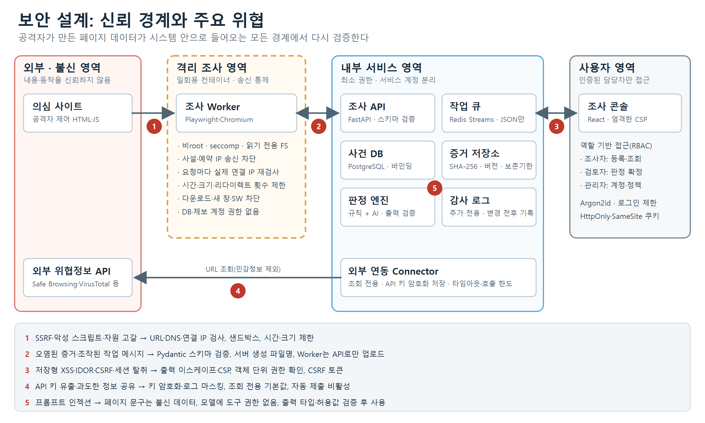

# 위협 모델

## 신뢰 경계

| 경계 | 넘어오는 데이터 | 주요 위협 | 대책 | 담당 |
|---|---|---|---|---|
| ① 의심 사이트 → Worker | HTML·JS·리다이렉트·하위 요청 | SSRF, 악성 스크립트, 자원 고갈 | URL·DNS·연결 IP 검사, 샌드박스, 시간·크기·리다이렉트 제한 | 역할 ① |
| ② Worker → 내부 서비스 | 증거 파일, 작업 결과 | 오염된 증거, 조작된 메시지 | 스키마 검증, 서버 생성 파일명, Worker는 API로만 업로드(DB 접근 불가) | 역할 ①③ |
| ③ 내부 서비스 → 콘솔 | 수집한 제목·텍스트·URL, 실시간 화면(JPEG)·녹화(WebM) | 저장형 XSS, IDOR, CSRF, 세션 탈취, 악성 페이지 직접 노출 | 이스케이프·CSP, 객체 단위 권한, CSRF 토큰, 화면은 이미지·영상으로만 전달(형식 검사) | 역할 ③ |
| ④ Connector → 외부 API | 조회 URL | API 키 유출, 과도한 정보 공유 | 키 암호화·로그 마스킹, 조회 전용, 자동 제출 비활성 | 역할 ② |
| ⑤ 판정 엔진 내부 | 페이지 문구 → AI 모델 | 프롬프트 인젝션 | 불신 데이터 분리, 도구 권한 없음, 출력 검증 | 역할 ② |

## STRIDE

| 분류 | 대상 | 위협 | 대책 | 체크리스트 |
|---|---|---|---|---|
| 위장 (S) | 콘솔 로그인·세션 | 계정 탈취·세션 도용 | Argon2id, 로그인 제한, 안전한 쿠키 | SC-SF-01 |
| 변조 (T) | 증거·판정 이력 | 증거 바꿔치기 | SHA-256·버전, 쓰기 권한 분리 | SC-IN-04 |
| 부인 (R) | 판정 변경·제출 | 변경자 불명 | 추가 전용 감사 로그 | `audit_logs` |
| 정보 노출 (I) | 스크린샷·URL 쿼리·API 키 | 개인정보·토큰 유출 | 마스킹, 시크릿 분리, 오류 최소화 | SC-EN-02, SC-EH-01 |
| 서비스 거부 (D) | Worker·큐 | 무한 리다이렉트·대용량 페이지·렌더러 멈춤 | 제한값, 재시도 상한, dead-letter, 수집 1건 전체 시간 제한 + 프로세스 그룹 강제 종료(D2 평가에서 대용량 문서가 Worker를 30분 넘게 멈춘 것을 발견해 추가) | SC-CE-01, SC-CE-03 |
| 권한 상승 (E) | 브라우저 → 내부망 | SSRF·샌드박스 탈출 | 사설 IP 차단, 송신 방화벽, 비root·seccomp | SC-IN-03 |

## Docker 네트워크 구성 (`compose.yaml`)

| 네트워크 | 연결 서비스 | 외부 통신 |
|---|---|---|
| public | frontend | 콘솔 포트 공개 (127.0.0.1:8080) |
| web | frontend, backend | 불가 (internal) |
| data | backend, outbox-relay, migrate, db | 불가 (internal) |
| jobs | backend, outbox-relay, worker, redis | 불가 (internal) |
| api | backend, worker | 불가 (internal). Worker → `/internal/v1` 전용, 서비스 토큰 인증 |
| sandbox | worker, feed-collector, egress-proxy | 불가 (internal). Worker·피드 수집기가 밖으로 나가는 유일한 길 |
| egress | egress-proxy, testsites | 가능. 프록시가 연결마다 목적지 IP를 검사(사설·예약·메타데이터 주소 차단) |

Worker는 `data` 네트워크에 연결되지 않으므로 DB에 직접 접근할 수 없다. 증거 파일 볼륨(`evidence`)도 backend에만 연결된다.
Worker는 `egress` 네트워크에도 붙지 않는다. 인터넷 DNS·직접 연결이 모두 불가하고, 조사 대상에는 `egress-proxy`를 거쳐서만 닿는다.
프록시는 표준 라이브러리만 쓰는 작은 서비스로, 요청·응답 본문과 헤더를 기록하지 않고 호스트·포트·판정만 로그에 남긴다.

## 알려진 한계

| 한계 | 영향 | 해결 계획 |
|---|---|---|
| ~~Playwright route는 HTTP 리다이렉트의 다음 단계를 가로채지 못함~~ | 하위 자원 리다이렉트가 내부 주소로 향하면 요청이 나갈 수 있었음 | ✅ 해결: 송신 프록시가 연결 시점에 차단. 기록은 `network_summary.subresource_redirects` |
| ~~DNS 조회와 연결 사이의 주소 변경(리바인딩)~~ | 검사 통과 후 내부 주소로 연결될 수 있었음 | ✅ 해결: 프록시가 한 번 조회해 검사한 IP로 직접 연결 |
| HTTP 요청은 프록시가 연결마다 1건만 전달 | 브라우저가 연결을 새로 열어 약간 느려짐(모든 요청이 다시 검사되는 대가) | 성능 문제 시 연결 재사용 중 호스트 변경을 검사하는 방식 검토 |
| ~~컨테이너 안에서 Chromium 샌드박스 꺼짐~~ | 렌더러 취약점 악용 시 컨테이너 권한까지 도달할 수 있었음 | ✅ 해결: Docker 기본 seccomp + clone·unshare·setns·chroot만 추가 허용한 프로필로 샌드박스 켬. 렌더러가 별도 user·pid·net 네임스페이스에서 실행됨을 확인 |
| 계정별 로그인 잠금은 남이 일부러 틀려서 특정 계정을 15분 잠글 수 있음 | 담당자 로그인 지연(계정 탈취보다 가벼운 위험을 택함) | nginx IP별 제한으로 대량 시도 억제, 감사 로그 `auth.login_locked`로 탐지. 운영 시 2단계 인증 검토 |
| 콘솔은 TLS 없이 127.0.0.1에서만 열림(개발·시연) | `__Host-`·Secure 쿠키는 브라우저가 localhost를 안전한 출처로 보기 때문에 동작 | 운영 배포 시 TLS 필수(SC-SF-06) |
| 인젝션 탐지 규칙은 새로운 표현으로 우회될 수 있음 | 탐지를 피한 문구가 모델을 속일 수 있음(Qwen3-1.7B는 데이터 구역 표시·지시 반복만으로는 막지 못함을 실험으로 확인) | 정책으로 피해를 제한: 모델만으로는 SUSPICIOUS가 되지 않고, 규칙이 SUSPICIOUS인데 모델이 정상이라고 하면 보류. 속은 모델이 만들 수 있는 최악은 '보류'이고 '안전'은 아니다. D2 공격 시나리오로 탐지 규칙 보강 |
| 소형 모델의 판단 품질·확신도 | 개발용 7건에서 두 모델 모두 정상 페이지를 확신도 0.9 이상으로 피싱이라고 답함(보정 전 확신도는 믿을 수 없음) | 기본값은 규칙만(AI_MODEL=none). 모델 판단은 보류 사유로만 쓰고 확신도는 '보정 전'으로 표시. 평가 데이터(D1)로 채택·기준값 재결정 |
| CI 러너에서는 Chromium 샌드박스 꺼짐 | GitHub Ubuntu 24.04 러너의 AppArmor가 비특권 user namespace를 막음. 대상은 러너 안 로컬 시험 서버뿐 | 운영·시연 환경(compose)은 켠 상태 유지, `test_sandbox_config.py`로 설정 회귀 검사 |
